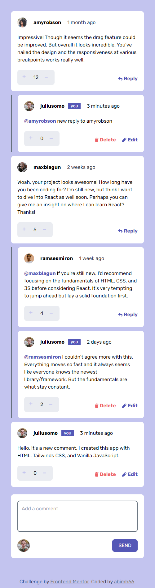

# Sunnyside Agency Landing Page

Project ini berdasarkan pada challenge di Frontend Mentor [Interactive comments section challenge on Frontend Mentor](https://www.frontendmentor.io/challenges/interactive-comments-section-iG1RugEG9).

## Daftar Isi

- [Overview](#overview)
  - [Penjelasan Project](#the-challenge)
  - [Screenshot](#screenshot)
  - [Links](#links)
- [Proses](#proses)
  - [Stack yang digunakan](#stack-yang-digunakan)
  - [Hal yang dipelajari](#hal-yang-dipelajari)
  - [Resources](#resources)
- [Author](#author)

## Overview

### Penjelasan Project

Pada project ini saya membuat sebuah aplikasi CRUD comment section. Saya menggunakan data.JSON yang disediakan oleh frontendmentor untuk data data awalnya. Saya juga menggunakan _local storage_ untuk menyimpan data sementara yang diinputkan oleh user.
Objektif pada project ini:

- Menampilkan layout yang sesuai dengan ukuran layar(responsive)
- Create, Read, Update, dan Delete comments dan replies
- Upvote dan downvote comments
- Menggunakan local storage untuk menyimpan data
- Secara dinamis, melakukan _time tracking_ terhadap comment dan reply, untuk mengetahui kapan comment dan reply dibuat.

### Screenshot

**Tampilan Desktop**

**Tampilan Mobile** 

### Links

- Solution URL: [Solution Code](https://github.com/abimh66/interactive-comments-section-frontendmentor)
- Live Site URL: [Live Site](https://interactive-comments-abimh66.netlify.app/)

## Proses

### Stack yang digunakan

- Semantic HTML5 markup
- [Tailwind CSS](https://tailwindcss.com/) - CSS Framework
- Flexbox
- Mobile-first workflow
- Vanilla JavaScript

### Hal yang dipelajari

Banyak hal yang dipelajari dari project ini terutama adalah JavaScript. Berikut banyak hal yang saya pelajari dari project ini.

- Menggunakan _Top Level Await_ untuk mendapatkan data.JSON tanpa menggunakan async function.
- DOM Traversing
- Insert HTML Tag secara dinamis(menyesuaikan data yang diberikan) menggunakan vanilla javascript
- Menggunakan JavaScript Date()
- dan masih banyak lagi.

### Resources

- [Tailwind CSS Documentation](https://tailwindcss.com/docs/installation)
- [Mozilla MDN JavaScript Documentation](https://developer.mozilla.org/en-US/docs/Web/JavaScript)

## Author

- Website - [abiproject.com](https://www.abiproject.com)
- Frontend Mentor - [@abimh66](https://www.frontendmentor.io/profile/abimh66)
- Codewars - [@abimh66](https://www.codewars.com/users/abimh66)
- Twitter - [@abimhrdnt](https://www.twitter.com/abimhrdnt)
